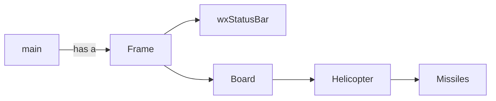

# Helicopter game

## Abstract

The goal of the game is to drive the helicopter and kill enemies.

## How to

```bash
# compile
02_helicopter_game % git clone --recurse-submodules https://github.com/wxWidgets/wxWidgets.git
02_helicopter_game % mkdir build && cd build
build % source ../build.sh

# execute
build % ./build_src/exec

# tests
# todo

# optional: compile only the source
02_helicopter_game % cd build/build_src
build_src % clang++ -std=c++17 `../build_wx/wx-config --cxxflags` ../../src/*.cpp -o exec `../build_wx/wx-config --libs`

```

## Diagram



## Todo

- Better actualization code
- Better compilation method
- Add tests
- Add enemies
